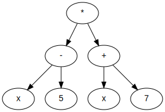
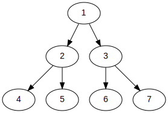
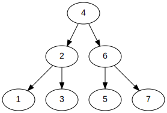

# pythonRecursion

A [recursão](https://pt.wikipedia.org/wiki/Recursividade_(ci%C3%AAncia_da_computa%C3%A7%C3%A3o)) é um recurso poderoso da computação. A recursão faz parte da abordagem
"dividir para conquistar", onde um problema grande é dividido em problemas 
menores, que por sua vez são resolvidos.

## Sumário

* [Introdução](#introdução)
* [Características](#características)
* [Exercícios](#exercícios)
* [Referências](#referências)

## Introdução

Vamos considerar o seguinte exemplo. Considerando uma 
[árvore binária](https://pt.wikipedia.org/wiki/%C3%81rvore_bin%C3%A1ria) da seguinte
estrutura:



Esta árvore codifica a equação `y = (x-5)*(x+7)` (**y** está implícito).

Como poderíamos fazer para percorrer esta árvore? Podemos escrever

```python
# representação em heap da árvore binária
tree = ['*', '-', '+', 'x', '5', 'x', '7']
for i in range(len(tree)):
    print(tree[i])
```

Mas isso não fará com que a árvore seja percorrida corretamente (pelo menos os itens não serão impressos na ordem correta). 
Se tentarmos, vamos perceber que é muito difícil escrever um algoritmo **simples**
que percorra a árvore utilizando apenas **laços de repetição**.

Com recursão, contudo, o código-fonte fica muito mais simples:

```python
def percorre(i, graph):
    if i >= len(tree):
       return 
    
    lft = (i * 2) + 1
    rgt = (i * 2) + 2
   
    percorre(lft, graph)
    print(graph[i], end=' ')
    percorre(rgt, graph)

# representação em heap da árvore binária
tree = ['*', '-', '+', 'x', '5', 'x', '7']
percorre(0, tree)
```

A saída será exatamente o que queremos: `x - 5 * x + 7`

Vamos entender o que está acontecendo aqui. Após **definir** a função `percorre`
(e lembrando que **definir** é diferente de **invocar**, de **executar**), as duas primeiras instruções que são executadas são

```python
tree = ['*', '-', '+', 'x', '5', 'x', '7']
percorre(0, tree)
```

Ou seja, estamos definindo a árvore como se fosse uma lista de valores (chamamos
isso na Ciência da Computação de 
[árvore heap](https://en.wikipedia.org/wiki/Heap_(data_structure))), 
e depois **invocando** a função `percorre`, passando
como parâmetros o **índice do nó-raiz da árvore** (que é sempre zero; nós sempre
começamos a percorrer a lista de valores pelo índice zero), e a própria árvore,
como uma lista de valores. 

Dentro da função `percorre`, o primeiro pedaço de código-fonte que encontramos
é o que chamamos de **condição de parada**:

```python
if i >= len(tree):
       return 
```

A condição de parada testa se o índice do nó atual é maior do que o comprimento 
da árvore. 

Após este teste, calculamos o índice dos nós-filho da esquerda `lft` e direita 
`rgt`, e logo em seguida chamamos a função `percorre` novamente, passando o nó-filho
da esquerda `lft` como parâmetro:

```python
lft = (i * 2) + 1
rgt = (i * 2) + 2

percorre(lft, graph)
```

Esta é a parte do "dividir" em "dividir para
conquistar": estamos dividindo o problema em subproblemas menores, antes de resolvê-lo.

Perceba que este passo-a-passo (checar a condição de parada, calcular os índices
dos nós-filho, e seguir primeiro pelo filho da esquerda) seguirá até que a condição de parada seja alcançada. Uma vez que ela for alcançada, iremos imprimir a informação
do nó atual, e seguir pelo filho da direita:

```python
print(graph[i], end=' ')
percorre(rgt, graph)    
```

Os índices dos nodos como eles **aparecem** na lista `tree`, e os índices como 
eles são **impressos** pelo algoritmo recursivo são mostrados abaixo:




## Características

As características de um algoritmo recursivo são as seguintes:

* Subdivide um problema grande em problemas menores
* Chama a si mesmo dentro do seu código-fonte
* Possui uma condição de parada para verificar quando não mais for necessário
  subdividir o problema

## Exercícios

1. Escreva uma função recursiva para calcular a soma de uma lista de listas:
   ```python
   def somador(a):
       pass  # defina o código-fonte aqui
   
   lista = [2, 3, [5,7], [11,13]]
   somador(lista)  # saída deve ser 41 
   ```

2. Escreva uma função **não-recursiva** para resolver o exercício da tarefa 1, para as seguintes listas:
   * `[2, 3, [5,7], [11,13]]`
   * `[2, [3], [4, 5], [[1]], [[[3], 2], 1]`

3. Sem utilizar a função `sorted` de Python, escreva um algoritmo não-recursivo para ordenar uma lista de valores:
   ```python
   def ordenador(a):
       pass  # defina o código-fonte aqui
   
   lista = [2, 3, [5,7], [11,13]]
   ```

4. Escreva um algoritmo **recursivo** para resolver o problema do exercício 3. Dica: você pode se inspirar no 
   [quicksort](https://pt.wikipedia.org/wiki/Quicksort), mas você deve mesmo assim escrever sua própria implementação
   em Python.

## Referências

Para compilar os grafos da pasta [graphs](graphs), siga o passo-a-passo abaixo.

1. Instalar graphviz na máquina (assumindo que você 
   [já tenha criado um ambiente virtual](https://github.com/CTISM-Prof-Henry/pythonEssentials/blob/main/chapters/venvs.md#criando-e-usando-pela-linha-de-comando)):
    ```bash
    conda install --file requirements.txt
   ```
2. Rodar o comando

   ```bash 
   dot -Tsvg <nome do arquivo .dot> > <nome da imagem .svg>
   ```

   Por exemplo:
   
   ```bash 
   dot -Tsvg graphs/balanced_binary_tree.dot > images/balanced_binary_tree.svg
   ```


